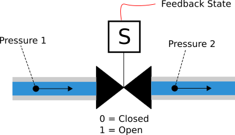

# Mechanical State Classifier

## Overview

Mechanical systems can operate in a number of states either as expected or in various failure modes. This project looks at an example of a flow control device that is monitored with pressure sensors and discrete position sensors to determine how the equipment is operating. This example generates synthetic data for upstream and downstream pressure. In these systems there is often a desired value for the valve state as 'OPEN' or 'CLOSED'. We'll have two other variables defined as `input_state` with the position of the valve we desire, and `feedback_state` with the position of the valve as it actually exists. Why do this? This allows the identification of an equipment failure when these two values disagree. When those values disagree, it implies the valve is stuck in a undesired position.

Our generated data will be classified as one of the following for any given instance in time:

1. Normally open with upstream pressure greater than downstream pressure
2. Normally closed where upstream pressure is greater than downstream pressure
3. Reverse pressurization open where downstream sensor exceeds upstream sensor
4. Reverse pressurization close where downstream sensor exceeds upstream sensor
5. Valve stuck open where input state and feedback state disagree
6. Valve stuck closed where input state and feedback state disagree

With the generated data, we'll define, compile and train a dense neural network to classify the above states. This model can be used in real-time monitoring of systems to quickly classify probabilities of failures to reduce any downtime in repairing equipment.

Lastly, we'll export the model and utilize it in a `simulation.py` script that randomly generates time series data of a system and classify the states dynamically.

## Documentation

There are several notebooks within the `notebooks` directory. They focus on 

1. Data Generation
2. Neural Network Creation and Training
3. Real-Time Data Animation

## File Structure

`data` - Contains csv file for generated states of the defined problem in the exploration notebook.

`figs` - Directory to store animations from `simulation.py`

`notebooks` - Jupyter notebooks used for data exploration and documentation.

`src` - Primary functions used within the `main.py` script. 

    1. `data` - Functions to process the raw csv data
    2. `model` - Tensorflow model definition and compile_and_fit function

## Dependencies 

The `requirements.txt` file has the appropriate python libraries for a virtual environment.

